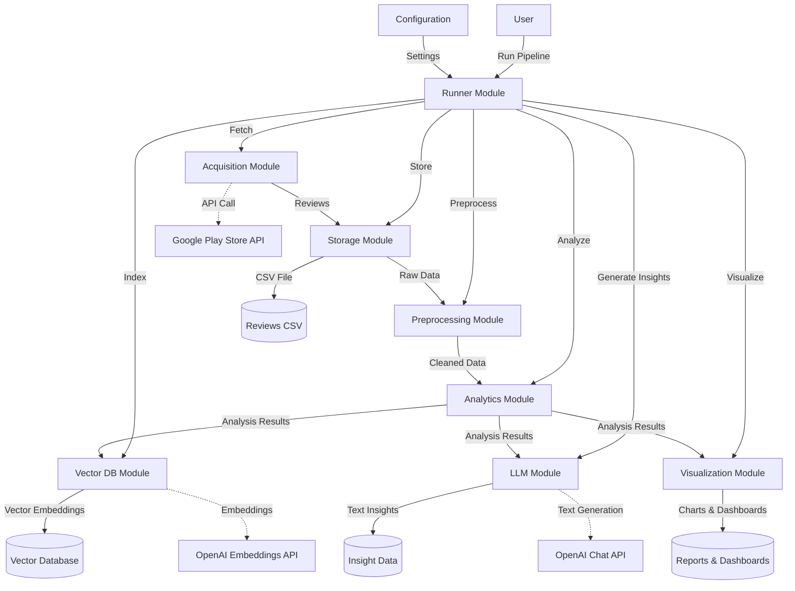
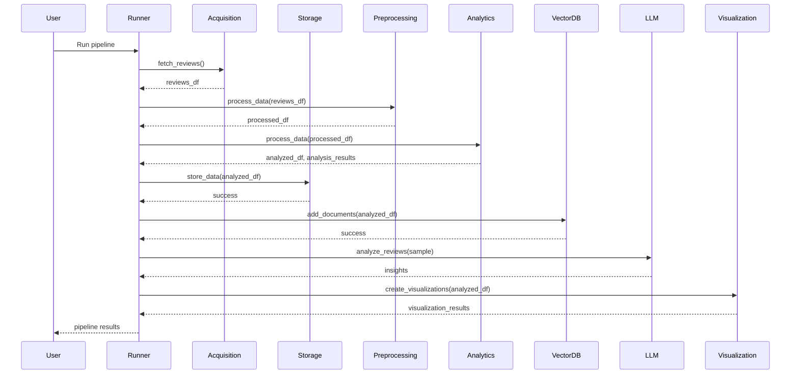

# App Reviews AI

A modular system for analyzing app reviews from the Google Play Store. This tool helps extract insights, identify issues, and visualize trends from user reviews.

## Features

- **Review Collection**: Fetch reviews from the Google Play Store for a specified time period
- **Text Preprocessing**: Clean and normalize review text for analysis
- **Sentiment Analysis**: Analyze sentiment in reviews
- **Topic Modeling**: Identify key topics and themes in reviews
- **Trend Analysis**: Track changes in ratings and sentiment over time
- **Keyword Extraction**: Identify important terms and concepts
- **Vector Search**: Semantically search through reviews
- **LLM Insights**: Generate structured insights using OpenAI's GPT models
- **Interactive Visualizations**: Create insightful charts and dashboards

## System Architecture

The system follows a modular architecture with well-defined interfaces between components:

- **Acquisition Module**: Fetches reviews from data sources
- **Storage Module**: Stores and retrieves review data
- **Preprocessing Module**: Cleans and normalizes text
- **Analytics Module**: Performs statistical analysis and modeling
- **Vector DB Module**: Handles semantic indexing and search
- **LLM Module**: Generates insights using large language models
- **Visualization Module**: Creates charts and dashboards

### Architecture Diagram



### Module Interaction Flow



## Getting Started

### Prerequisites

- Python 3.8+
- OpenAI API key (for LLM insights)

### Installation

1. Clone the repository:
   ```
   git clone https://github.com/yourusername/app-reviews-ai.git
   cd app-reviews-ai
   ```

2. Create a virtual environment:
   ```
   python -m venv venv
   source venv/bin/activate  # On Windows: venv\Scripts\activate
   ```

3. Install dependencies:
   ```
   pip install -r requirements.txt
   ```

4. Download required NLTK resources:
   ```
   python setup_nltk.py
   ```

5. Create a `.env` file based on the template:
   ```
   cp .env.template .env
   ```
   
6. Edit the `.env` file with your settings:
   ```
   # App Store Configuration
   APP_ID=com.yourapp.android
   APP_STORE=google_play
   USE_MOCK_DATA=true
   CLEAR_COLLECTION=true
   
   # API Keys
   OPENAI_API_KEY=your_openai_api_key
   
   # Analysis Configuration
   MAX_REVIEWS=1000
   START_DATE=1 year ago
   END_DATE=now
   ```

### Configuration

The application can be configured through the `config/config.json` file or environment variables. See `src/config.py` for details on available configuration options.

### Usage

#### Command Line Interface

Run the full pipeline:

```
python run.py --max-reviews 100
```

The app will use the settings from your `.env` file, but you can override them with command-line arguments:

```
python run.py --app-id com.example.app --start-date "6 months ago" --end-date now --max-reviews 500
```

To use real data from the Google Play Store:
```
USE_MOCK_DATA=false python run.py
```

#### Clearing Reports

To clean up report files (charts, visualizations, etc.) that accumulate after multiple runs:

```
python clear_reports.py
```

This script removes all generated files from the `reports` directory. You can create a backup before clearing:

```
python clear_reports.py --backup
```

For more detailed output:
```
python clear_reports.py --verbose
```

#### Command-line Options

For the main application:
- `--config`: Path to configuration file
- `--app-id`: App ID (package name)
- `--start-date`: Start date for reviews (YYYY-MM-DD or relative like '1 year ago')
- `--end-date`: End date for reviews (YYYY-MM-DD or 'now')
- `--max-reviews`: Maximum number of reviews to fetch
- `--skip`: Stages to skip (fetch, preprocess, analyze, store, index, insights, visualize)

#### Python API

```python
from src.runner import ReviewAnalysisRunner
import os

# Set environment variables (optional, can also use .env file)
os.environ["APP_ID"] = "com.example.app"  
os.environ["USE_MOCK_DATA"] = "false"  # Use real data

# Initialize the runner
runner = ReviewAnalysisRunner()

# Run the full pipeline
result = runner.run_pipeline(
    app_id=os.environ.get("APP_ID", ""),  # Use app ID from environment
    start_date="1 year ago",
    end_date="now",
    max_reviews=500
)

# Access results
reviews_df = result["reviews_df"]
insights = result["insights"]
visualizations = result["visualizations"]
```

#### Jupyter Notebook

See the demo notebook in `notebooks/review_analysis_demo.ipynb` for an interactive tutorial.

## Project Structure

```
app-reviews-ai/
├── config/                 # Configuration files
├── data/                   # Data storage
│   └── vector_db/          # Vector database files
├── logs/                   # Log files
├── notebooks/              # Jupyter notebooks
├── reports/                # Generated reports and visualizations
├── src/                    # Source code
│   ├── modules/            # Module implementations
│   │   ├── acquisition/    # Data acquisition modules
│   │   ├── analytics/      # Analytics modules
│   │   ├── llm/            # LLM integration modules
│   │   ├── preprocessing/  # Text preprocessing modules
│   │   ├── storage/        # Data storage modules
│   │   ├── vector_db/      # Vector database modules
│   │   └── visualization/  # Visualization modules
│   ├── config.py           # Configuration management
│   ├── initialize_resources.py # Initializes NLTK resources
│   └── runner.py           # Main pipeline runner
├── tests/                  # Unit and integration tests
├── .env                    # Environment variables (not in repo)
├── .env.template           # Template for environment variables
├── .gitignore              # Git ignore file
├── clear_reports.py        # Utility to clear generated reports
├── LICENSE                 # License file
├── README.md               # This file
├── run.py                  # Wrapper script for easier execution
├── setup_nltk.py           # Manual NLTK setup script
└── requirements.txt        # Python dependencies
```

## Extending the System

### Adding a New Data Source

1. Create a new class in `src/modules/acquisition/` that implements the `ReviewAcquisitionInterface`
2. Implement the required methods like `fetch_reviews()` and `get_app_info()`
3. Update the runner to use your new acquisition class

### Adding a New Analysis Method

1. Create a new method in `src/modules/analytics/review_analyzer.py` or extend the `AnalyticsInterface`
2. Implement your analysis logic
3. Update the runner to call your new analysis method

## FAQ

### How does the system handle OpenAI API costs?

The system is designed to be cost-efficient when using OpenAI's API:

1. The LLM module is **only** used in the `generate_insights` step, not for processing individual reviews.
2. Instead of calling the API for each review, the system:
   - Takes a stratified sample of reviews (maximum 100, even if you have 10,000+ reviews)
   - Groups them into a single batch request
   - Makes just 3 API calls total (one for each insight type: general, issues, suggestions)

For 10,000 reviews, the total OpenAI API cost would likely be under $1 USD with the current implementation.

To further reduce costs, you can:
- Reduce the number of insight types in the configuration
- Use a smaller/cheaper model by changing `model` in the config
- Decrease the sample size in the `generate_insights` method

### What happens when running the pipeline multiple times?

By default, the system **overwrites** previous data:

1. For CSV storage: The `store_data` method uses `append=False` by default, so each run will overwrite the previous CSV file.

2. For Chroma vector database: Documents with the same IDs will be updated/replaced, and new documents will be added.

To modify this behavior:

- For CSV storage: Change `append=False` to `append=True` in the `store_data` call in `runner.py` to append new reviews.
- For Chroma: Add a call to `delete()` before `add_documents()` if you want to completely refresh the database each time.

### Can the system work without internet access?

Yes, the system can work offline using mock data:

1. The `GooglePlayReviewAcquisition` module has a `_generate_mock_reviews` method that creates realistic sample reviews.

2. You can toggle between real and mock data using the `USE_MOCK_DATA` environment variable:
   ```
   # In your .env file
   USE_MOCK_DATA=true
   
   # Or when running the command
   USE_MOCK_DATA=true python run.py
   ```

3. When in mock data mode, the system automatically:
   - Uses locally generated mock reviews instead of fetching from Google Play
   - Uses local sentence transformer embeddings instead of OpenAI embeddings
   - Stores data in a separate collection to avoid mixing with real data
   - Skips OpenAI API initialization and uses mock responses for LLM insights
   - Avoids making any billable API calls

4. You can also control whether to clear existing collection data before adding new reviews:
   ```
   # In your .env file
   CLEAR_COLLECTION=true
   
   # Or when running the command
   CLEAR_COLLECTION=true USE_MOCK_DATA=true python run.py
   ```

5. When API calls fail, the system automatically falls back to using mock data with a warning in the logs.

6. You can customize review count with the MAX_REVIEWS environment variable:
   ```
   # In your .env file
   MAX_REVIEWS=10
   
   # Or when running the command
   MAX_REVIEWS=10 python run.py
   ```

#### Note on NLTK Resources

The system requires NLTK resources for text processing. These are automatically downloaded when the application starts, which requires an internet connection. After the initial download, these resources are cached and can be used offline.

The system now handles NLTK resources more efficiently:
- Resources are downloaded only once at application startup
- A dedicated initialization script prevents duplicate downloads
- The system properly handles missing resources with appropriate fallbacks

If you encounter NLTK resource errors, you can manually download required resources using the provided script:

```
python setup_nltk.py
```

Or download them directly:

```python
import nltk
nltk.download('punkt')
nltk.download('stopwords')
nltk.download('wordnet')
nltk.download('omw-1.4')
```

#### Embedding Models

The system supports three types of embedding models for the vector database:

1. **OpenAI Embeddings** (Default for real data)
   - High-quality semantic embeddings using OpenAI's models
   - Requires API calls to OpenAI (billable)
   - Best semantic search results
   - Set with `embedding_model: "openai"` in config

2. **Sentence Transformers** (Default for mock data if installed)
   - Local, open-source embedding models 
   - No API calls required (runs completely offline)
   - Good semantic search results
   - Requires installing `sentence-transformers` package
   - Set with `embedding_model: "sentence_transformer"` in config

3. **Simple Mock Embeddings** (Fallback for mock data)
   - Basic vector representation based on text properties
   - No external dependencies
   - Limited semantic search capabilities
   - Used automatically when other options aren't available

When running with `USE_MOCK_DATA=true`, the system automatically selects the best available local embedding method to avoid OpenAI API costs.

### How many reviews can the system handle?

The system is designed to handle large volumes of reviews efficiently:

1. For data acquisition: The Google Play scraper handles pagination automatically, allowing retrieval of thousands of reviews.

2. For storage and analysis: Pandas and scikit-learn can handle hundreds of thousands of reviews on a standard computer.

3. For vector database: ChromaDB is designed for millions of embeddings and provides efficient searching.

4. To limit resource usage, use the `--max-reviews` parameter to set a cap on the number of reviews to process.

### What are the main outputs of the system?

The system produces several types of outputs:

1. **Data Files**:
   - CSV files with raw and processed reviews in `data/`
   - Vector database embeddings in `data/vector_db/`

2. **Insights**:
   - General review analysis
   - Issue identification
   - Suggestion extraction

3. **Visualizations** in `reports/visualizations/`:
   - Rating distribution charts
   - Rating trends over time
   - Word clouds of common terms
   - Topic distribution visualizations
   - Interactive HTML dashboard

## License

This project is licensed under the MIT License - see the LICENSE file for details.

## Acknowledgments

- Google Play Scraper for providing API access to Play Store reviews
- OpenAI for the GPT models used for insight generation
- ChromaDB for vector storage capabilities